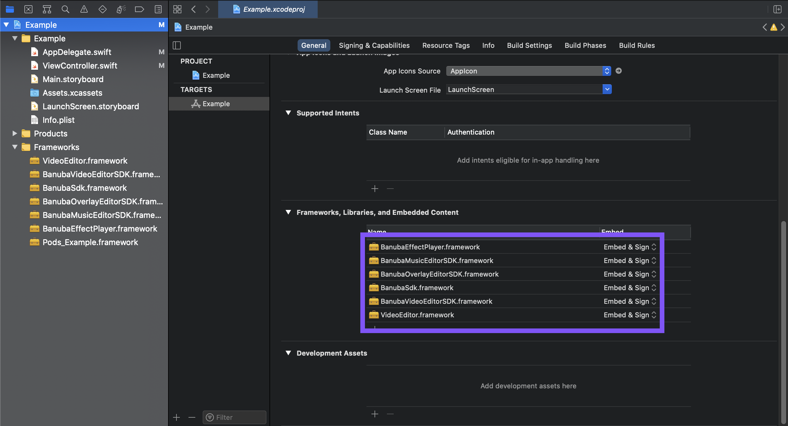

# Banuba Video Editor SDK Integration sample for iOS
[Banuba VE SDK](https://www.banuba.com/video-editor-sdk)
The Most Powerful Augmented Reality Video Editor SDK for Mobile

## Requirements
- Swift 5+
- Xcode 12+
- iOS 11.0+

## Dependencies
- [Banuba Face AR SDK](https://www.banuba.com/facear-sdk/face-filters). *Optional*

## Free Trial
Before purchasing the license cost you have a 1-month free trial period.  
1. Sign NDA. [Contact Us](https://www.banuba.com/video-editor-sdk#form)
1. Clone this repository
1. Request [token](##Token)
1. Put tokens in the app
1. Start the sample
1. Follow [integration guide](##Getting-Started) to bring your customizations

## Token
Banuba uses tokens for [Face AR SDK](https://www.banuba.com/facear-sdk/face-filters) and VE SDK products to differentiate our clients, protects features and technology. SDK requires up to date tokens, otherwise SDK will crash the app.  
Since Banuba VE SDK includes Face AR SDK it is required to specify Face AR token for applying AR effects. Please, put the token [here](/Example/Example/ViewController.swift#L19)


## Getting Started
### Grant Access to Banuba repos via ssh
1. Paste provided Banuba ssh private key into .ssh folder on your Mac.
2. Add ssh private key to SSH authentication agent using `passphrase` provided by Banuba:
   ```sh
   sudo ssh-add <banuba-ssh-file>
   ```
### CocoaPods
VideoEditorSDK is available via CocoaPods. If you're new to CocoaPods, [this Getting Started Guide will help you](https://guides.cocoapods.org/using/getting-started.html). CocoaPods is the preferred and the simplest way get the VE SDK.

The example of Podfile lines which you have to add you can find [here](Example/Podfile)

1. Make sure to have CocoaPods installed, e.g., via [Homebrew](https://brew.sh):
   ```sh
   brew install cocoapods 
   ```
1. Install VideoEditorSDK for the provided Xcode workspace with:
   ```sh
   pod init
   pod install
   ```
1. Open `Example.xcworkspace` with Xcode and run the project.

### Manually
If you are not using any dependency manager you can integrate Video Editor SDK manually via a dynamic framework.

1) Download the SDK [here](), then simply drag all frameworks required by VideoEditorSDK into the *Frameworks, Libraries, and Embedded Content* section of your target and make sure that the *Embed* settings are set to *Embed & Sign*:

 


### Start Video Editor from ViewController
``` swift
import BanubaVideoEditorSDK

class ViewController: UIViewController {

    private var videoEditorSDK: BanubaVideoEditorSDK?

    override func viewDidLoad() {
        super.viewDidLoad()
    
        initVideoEditor()
    }

    override func viewDidAppear(_ animated: Bool) {
        super.viewDidAppear(animated)

        videoEditorSDK?.presentVideoEditor(
            from: self,
            animated: true,
            completion: nil
        )
    }
  
    private func initVideoEditor() {
        let configuration = VideoEditorConfig()
        videoEditorSDK = BanubaVideoEditorSDK(
            token: "place client token here",
            effectsToken: "place effects token here",
            configuration: configuration,
            analytics: nil,
            externalViewControllerFactory: nil
        )
        videoEditorSDK?.delegate = self
    }
    ...
}

// MARK: - Handle Video Editor lifecycle
extension ViewController: BanubaVideoEditorSDKDelegate {
  func videoEditorDidCancel(_ videoEditor: BanubaVideoEditorSDK) {
    videoEditor.dismissVideoEditor(animated: true, completion: nil)
  }
  
  func videoEditorDone(_ videoEditor: BanubaVideoEditorSDK) {
    videoEditor.dismissVideoEditor(animated: true, completion: nil)
  }
}

```  

### Configure export flow
To export video after finishing editing use these several methods:
``` swift
 /// Export video with default 1280x720 (or 1920x1080 on required devices) resolution
  /// - Parameters:
  ///   - fileUrl: url where exported video should be stored.
  ///   - completion: completion: (success, error), execute on background thread.
  func exportVideo(fileUrl: URL, completion: @escaping (Bool, Error?) -> Void)
  
  /// Export video with default 1280x720 (or 1920x1080 on required devices) resolution and cover image
  /// - Parameters:
  ///   - fileUrl: url where exported video should be stored.
  ///   - completion: completion: (success, error, image), execute on background thread.
  /// Preconfigue WatermarkConfiguration in configuration file otherwise will be used default configuration. Default cover image video indent is 0.5 second.
  func exportVideoWithCoverImage(fileUrl: URL, completion: @escaping (Bool, Error?, UIImage) -> Void)
  
  /// Export several configurable video
  /// - Parameters:
  ///   - configurations: contains configurations for exporting videos such as file url,
  ///    watermark and video quality
  ///   - completion: completion: (success, error), execute on the background thread.
  func exportVideos(using configurations: [ExportVideoConfiguration], completion: (Bool,Error?)->Void)
  
  /// Export several configurable video with cover image
  /// - Parameters:
  ///   - configurations: contains configurations for exporting videos such as file url,
  ///    watermark and video quality
  ///   - completion: completion: (success, error, image), execute on the background thread.
  func exportVideosWithCoverImage(using configurations: [ExportVideoConfiguration], completion: (_Bool, Error?, UIImage)->Void)
```  
Example export video flow see [here](/Example/Example/ViewController.swift#L599).
Detailed export video features you can find [here](ExportVideosExamples.md)

### Configure screens  
The SDK allows to override icons, colors, typefaces and many more configuration entities. Every SDK screen has its own set of styles.
Below you can find how to customize VE SDK to bring your experience.
